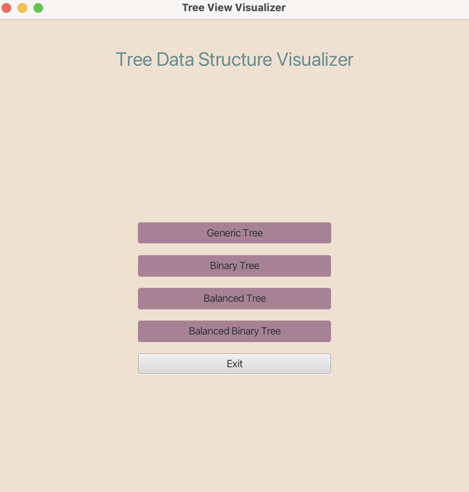
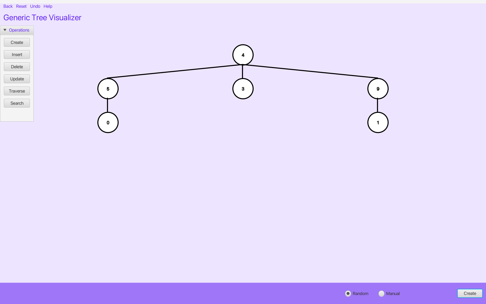

# OOP.20222.Team09

## Introduction
The project "Visualization of Operations on Tree Data Structures" aims to design a program that allows users to visualize and understand basic operations on different types of trees. In the project, we aim to create a software visualizer that can provide clear visual representations and detailed explanations for operations such as creating a tree, inserting nodes, deleting nodes, updating nodes, and traversing the tree. This helps users understand the process and purpose of each operation.

## Skills Assessment

| Name            | Skills                                                                                         |
|-----------------|------------------------------------------------------------------------------------------------|
| Nguyễn Nam Hải  | Package exception {NodeExistedException, NodeFullChildrenException, NodeNotExistsException}, Package operation {CreatePressed
,DeletePressed, InsertPressed, SearchPressed, UpdatePressed, UserAction}, Report (30%), Slide (45%) |
| Nguyễn Song Hào | Diagram (35%), Tree Data Structures (50%), Traverse Operation (100%), Forward Operation (100%), Backward Operation (100%), Node (40%), Package controller {GenericTreeController (the other 5 operations and 2 buttons: Reset & Undo), BalancedTreeController (insert operation), BinaryTreeController (100%), BalancedTreeController (100%), Package fxml {MainWindow.fxml (100%), GenericTree.fxml (100%)}BalancedBinaryTreeController (100%)}, Report (40%), Slide (45%), Testing (70%) |
| Hà Hoàng Hiệp   | Diagram (20%), Node (20%), Exception Handler (30%), Help Button (100%), Report (10%)         |
| Trần Thị Hiền   | Report (20%), Slide (10%), Testing (30%)         |

## Demo

### Main window interface:

### Tree operation interface:

Demo video link: https://drive.google.com/drive/folders/1R8Xx4x7oW1D-R2rHKEMiOvf4afPVoH-P?usp=sharing

